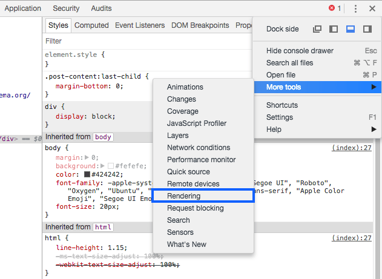

# print-css

Print web pages with style

Not something we do often: print a webpase. I was curious what it would take to have a nicely printed page. Mostly will serve my own needs at this moment, but to make it more usefull for others I have added the resources I used.

## PDF Size

Trying to print a 400+ pages PDF with images with Chrome initially generated a 100MB+ file, although the total size of the images was not nearly that big.

I tried with Firefox and Safari, and the size was less than 10MB.

After a few experiments it turned out Chrome has 3 ways to print an HTML to PDF:

- ❌ Don’t print it using the System Dialogue
- ❌ Don’t click “Open PDF in Preview”
- ✅ Instead, click the “Save” button that appears in the Chrome Print dialogue

This generates a PDF much quicker than with the other 2 ways, and with a much, much smaller size.

(source: https://flaviocopes.com/css-printing/)

## Debug the printing presentation

Emulate the print layout in Firefox:

Emulate the print layout in Google Chrome:

Once the panel opens, change the rendering emulation to `print`:

## Resources

**tutorial**

- [CSS: The Perfect Print Stylesheet | The JotForm Blog](https://www.jotform.com/blog/css-perfect-print-stylesheet-98272/)
- [How To Set Up A Print Style Sheet — Smashing Magazine](https://www.smashingmagazine.com/2011/11/how-to-set-up-a-print-style-sheet/)
- [How to print your HTML with style](https://flaviocopes.com/css-printing/)

**libs**

- [Gutenberg](https://github.com/BafS/Gutenberg/tree/master/scss)
- [Hartija CSS-Print-Framework](https://github.com/vladocar/Hartija---CSS-Print-Framework/blob/master/print.css)
